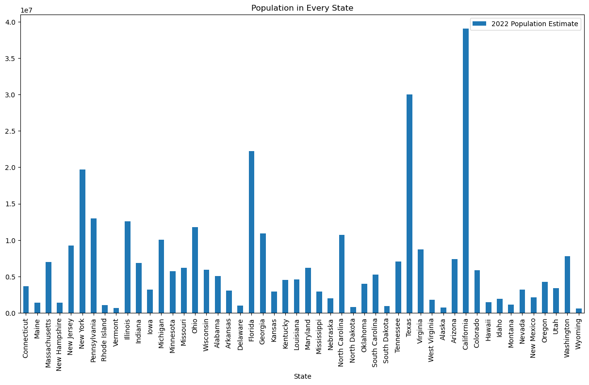
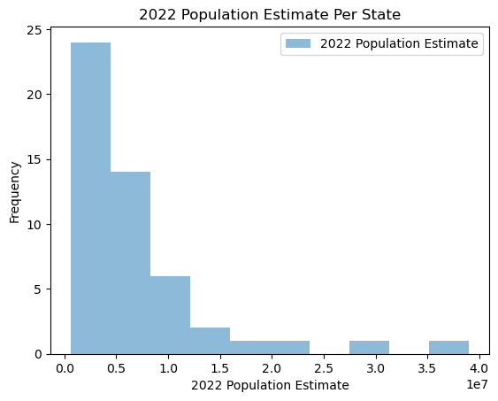
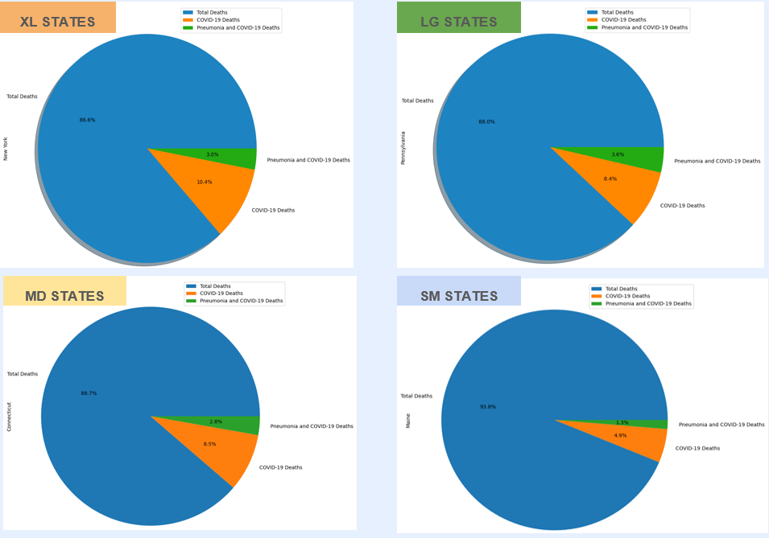
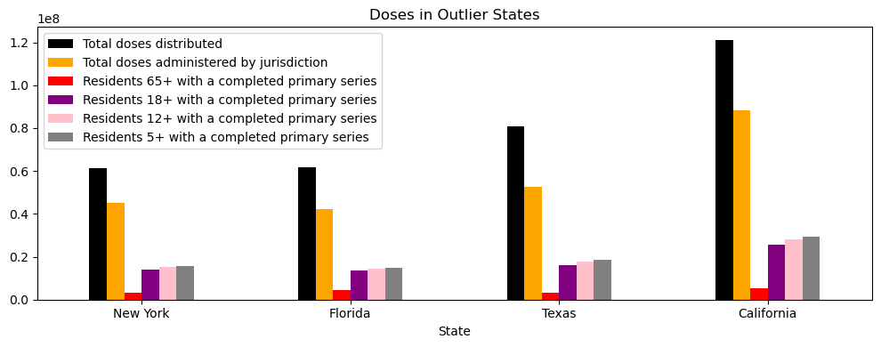
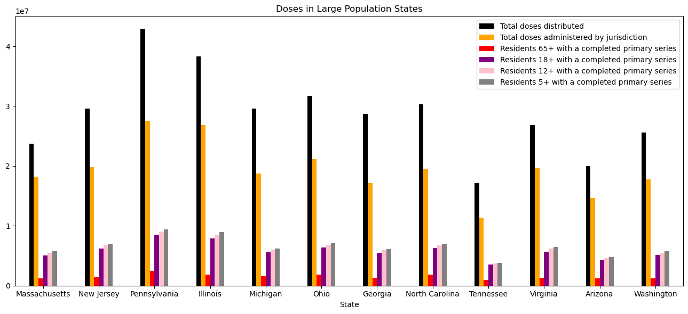
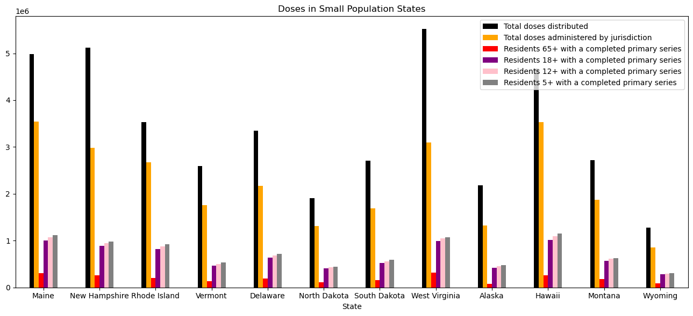
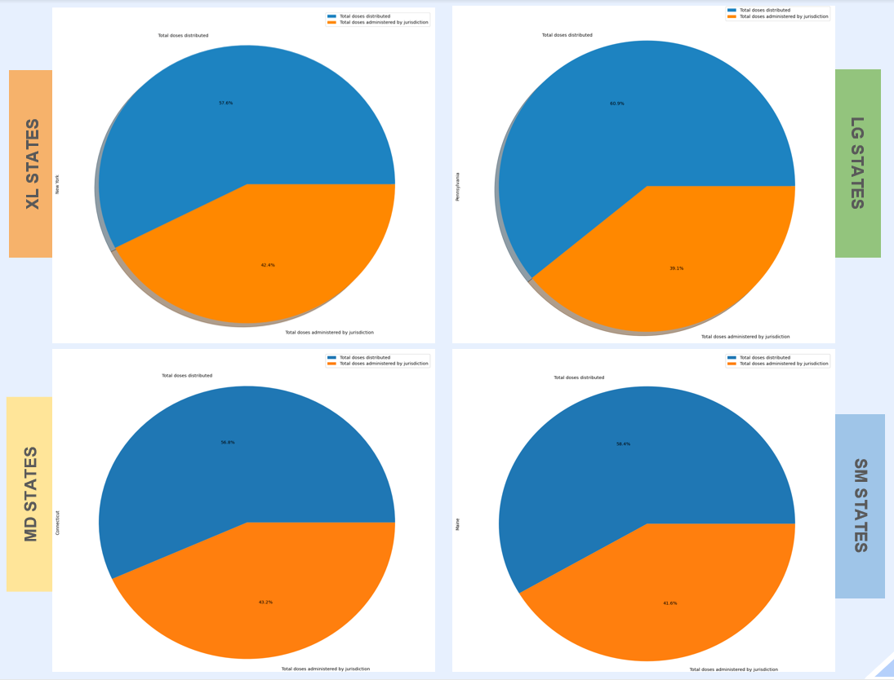

# Project-1:
## Vaccination and COVID-19 Deaths
#### By: Sally Anderson, Kenia Oquendo Berrios, Gwendolyn Lukman, and Jackie Rosales

# Introduction 
* Topic: Healthcare 
* Analysis: Factors affecting COVID-19 death rates

* The subject of our analysis was healthcare. Specifically, COVID-19 and death rates. Our analysis will conclude if external factors influence COVID-19 death rates. The chosen factors for this analysis are: population density and vaccine rates. 
* data was collected from government sources and cleaned. 
Time and scope were limiting factors: cummulative total 2020-2023 
states were only chosen and all other territories were remmoved from the data set.
we analysized the dataset that combined both sexes

# Datasets
Data.gov: Deaths involving COVID-19, pneumonia, and influenza reported to NCHS by sex, age group, and jurisdiction of occurrence.  

Census.gov: 2022 Population Estimate

CDC: COVID-19 vaccination rates

# Reasearch Hypothesis
## Hypothesis 1
Null Hypothesis 1
- The percent of people who died of COVID-19 is NOT affected by the state population.
Alternate Hypothesis 1
- The percent of people who died of COVID-19 will be higher in more highly populated states than in less populated states.

* Our prediction is to reject the Null Hypothesis 1.
* Logic: If the population is densely concentrated, then death rates by percent of the population will be higher, because the population will have a higher rate of interaction with one another.

## Hypothesis 2
Null Hypothesis 2
- Vaccination does NOT contribute to a decrease in death risk.
Alterate Hypothesis 2
- Vaccination contributes to a decrease in death risk.
* Our prediction is to reject the Null Hypothesis 2.
* Logic: If a person is vaccinated, they are less likely to die, regardless of their state's population density.

# Analysis
## Cleaning and assembling data

### Population per state
The United States has a population that varies widely among the diffrent states. 

The histogram of all states show highly skewed data

### Calculating the Quartile and classifying states into different groups  
To help normalize the data, we classified the states by their population sizes and came up with 4 groups using interquartile analysis (XL, Large, Medium and Small). We removed the outlier states: NY, FL, TX, & CA. 

XL States (outliers) = population > 19,677,151 and < 39,029,342
- Accounts for 33% of total United States population

With the new dataset, with outliers states removed, we ran another interquartile analysis to create threshold for new datasets for the rest of the states:

Large States (Q3 - top 75% of data) = population < 19,677,151 and > 6,944,739
- Accounts for 35% of total United States population
- States: MA, NJ, PA, IL, MI, OH, GA, NC, TN, VA, AZ, WA

Medium States (Q2 - 50% of data) = population < 6,944,739 & > 1,816,125
- Accounts for 28% of total United States population
- States: CT, IN, IA, MN, MO, WI, AL, AR, KS, KY, LA, MD, MS, NE, OK, SC, CO, ID, NV, NM, OR, UT

Small States (Q1 - lowest 25% of data)= population < 1,816,125
- Accounts for 4% of total United States population
- States: ME, NH, RI, VT, DE, ND, SD, WV, AK, HI, MT, WY

## Death Comparisons 
We arbitrarily chose states to represent each group\, showing the Total Deaths, COVID-19 Deaths, and Pneumonia and COVID-19 Deaths.

- The blue area shows the total of all deaths, due to any reason. The green area represents death due to multiple conditions (Pneumonia and COVID-19). The orange area represent death due to COVID-19. 
- The XL states had roughly 10% of the total deaths be due to COVID, while the large and medium state groups ranged from 7-9%, and the small states having roughly 5%. 
- We thought it was interesting that the XL states still carry the higher percentage death rate while they make up 33% of the population as opposed to the large state group, which contains 35% of the population. This may be explaned by the fact that the XL states have more dense compacted communities.
- We considered multiple conditions and how is that would raise the potential of death. We predicted that the death rates would be overall higher among those with multiple conditions at time of death versus exclusively COVID-19, specifically we looked at the deaths of Pneumonia and COVID-19 versus those with just COVID-19. However, the pie charts reject our prediction and show that the percentage of multiple conditions did not make as big of an impact, with percentages ranging from 3% in the XL populated states, to 1% in the smaller populated states.

## Residents with Completed Primary Series
We made a bar chart of each state by their groups (XL, large, medium, small) that includes, Total doses distributed, Total doses administered by jurisdiction, 
Residents 65+ with a completed primary series, Residents 18+ with a completed primary series, Residents 12+ with a completed primary series, Residents 5+ with a completed primary series

Trends:
- 65+ demographic had the lowest vaccination rates out of all the groups tested.
    - We predicted this would be the highest because they were considered the highest risk group for death. 
    - We are unsure about why this was the case since each state targeted this demographic heavily
-All states followed the same trend in vaccination totals: 5+ > 12+ > 18+ > 65+
    - Possible explanation: 
        - School age children (5+ & 12+ groups) were required to be vaccinated before going back to school
        - 18+ group were wanting to get back to regular life faster (and possibly less fearful of adverse effects from the vaccine)
        - 18+ group may have been required by their workplace to be vaccinated before returning to work in person

## Doses per State
 Trend: All states did not administer all doses that were distributed.
 

## H1: Hypothesis Testing
Shows independent t-tests for “2022 Population Estimate” vs “COVID-19 Deaths”
- p-value are as follows: 
    - All states: 0.00000008308
    - XL: 0.00791821963
    - L: 0.00000000768
    - M: 0.00000000001
    - S: 0.00000067855

Conclusion: 
- We REJECT Null Hypothesis 1: The amount of people who died of COVID-19 is NOT affected by the state population.
- We CANNOT REJECT Alternate Hypothesis 1: The amount of people who died of COVID-19 will be higher in more populated states than in less populated states.

## H2: Hypothesis Testing 
- Shows independent t-tests for “Residents with at least one dose” vs 
“COVID-19 Deaths”
- p-value are as follows: 
    - All states: 0.00000025333
    - XL: 0.00820147030
    - L: 0.00000002761
    - M: 0.00000000004
    - S: 0.00000223341

Conclusion: 
- We REJECT Null Hypothesis 2: Vaccination does NOT contribute to a decrease in the likelihood of death from COVID-19.
- We CANNOT REJECT Alternate Hypothesis 2: Vaccination contributes to a decrease in the likehood of deaths from COVID-19

# Summary of Findings
Major Trends:
* The XL states had roughly 10% of the total deaths be due to COVID, while the large and medium state groups ranged from 7-9%, and the small states having roughly 5%. 
* 65+ demographic had the lowest vaccination rates out of all the groups tested.
* All states followed the same trend in vaccination totals: 5+ > 12+ > 18+ > 65+
* All states did not administer all doses that were distributed.

Question 1: 
* What is the relationship between the amount of people who died of COVID-19 and the state population?

* Based on the data, we CANNOT REJECT the alternative hypothesis that says: The amount of people who died of COVID-19 will be higher in more populated states than in less populated states.

Question 2:
* What is the relationship between vaccination and its ability to protect from COVID-19 death? 

* Based on the data, we CANNOT REJECT the alternative hypothesis that says: Vaccination contributes to a decrease in the likelihood of death from COVID-19.

# Limitations and Future Works
* Limited to USA
* Cumulative data (year 2020 - 2023)
* Population data is only from latest 2022 Census data (does not account for population changes in 2023)

* Future works include analyzing additional data, such as gender, age, to see effects on death, and through time (years, months).

## Resources
1. Provisional COVID-19 Deaths by Sex and Age: https://catalog.data.gov/dataset/provisional-covid-19-death-counts-by-sex-age-and-state
2. 2022 Population Estimate: https://www2.census.gov/programs-surveys/popest/datasets/2020-2022/state/totals/
3. COVID-19 vaccination rates: https://covid.cdc.gov/covid-data-tracker/#vaccinations_vacc-people-booster-percent-pop5 

